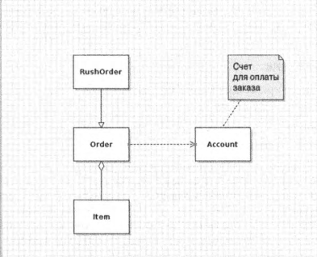

1. Объектно-ориентированное программирование. Основные понятия.

# Объективно-ориентированное программирование. Основные понятия.
## Введение в ООП
Объективно-ориентированная программа состоит из объектов. Каждый объект обладает определёнными функциональными возможностями, предоставляемыми в распоряжение пользователей, а также скрытой реализацией. Одни объекты для своих программ вы можете взять в готовом виде из библиотеки, другие вам придётся спроектировать самостоятельно. Как правило, до тех пор, пока объекты удовлетворяют вашим требованиям, вам не нужно особенно беспокоиться о том, каким образом реализованы их функциональные возможности.

## Классы
Наиболее важным понятием является класс. Класс - это шаблон или образец, по которому будет создан объект. Обычно класс сравнивают с формой для выпечки печенья, а объект - это само печенье. Конструирование объекта на основе некоторого класса называется получением экземпляра этого класса.

Весь код, написанный на Java, находится в классах. Стандартная библиотека Java содержит несколько тысяч классов, предназначенных для решения самых разных задач, например, для построения пользовательского интерфейса, календарей, установления сетевых соединений и т.д. Несмотря на это, программирующие на Java продолжают создавать свои собственные классы, чтобы формировать объекты, характерные для разрабатываемого приложения, а также приспосабливать классы из стандартной библиотеки под свои нужды.

*Инкапсуляция* (*иногда называемая сокрытием информации*) - это ключевое понятие для работы с объектами. Формально инкапсуляцией считается обычное обхединение данных и операций над ними в одном пакете и сокрытие данных от других объектов. Данные в объекте называеются полями экземпляра, а функции и процедуры, выполняющие операции над данными, - его методами. В конкретном объекте, т.е. экземпляре класса, поля экземпляра имеют определенные значения. Множество этих значений называется текущим состоянием объекта. Вызов любого метода для объекта может изменить его состояние.

Следует ещё раз подчеркнуть, что основной принцип инкапсуляции заключается в запрещении доступа к полям экземпляра данного класса из других классов. Программы должны взамиодействовать с данными объекта только через методы этого объекта. Инкапсуляция обеспечивает внутреннее поведение объектов, что имеет решающее значение для повторного их использования и надежности работы программ. Это означает, что в классе можно полностью изменить способ хранения данных. Но поскольку для манипулирования данными используется одни и те же метода, то об этом ничего не известно, да и не особенно важно другим объектам.

Ещё один принцип ООП облегчает разработку собственных классов в Java: один класс можно построить на основе других классов. В этом случае говорят, что новый класс *расширяет* тот класс, на основе которого он создан. 

Если класс разрабатывается на основе уже существующего , то новый класс содержит все свойства и методы расширяемого класса. Кроме того, в него добавляются новые методы и поля данных. Расширение класса и получение на его основе нового называется *наследованием*.

## Объекты
В ООП определены следующие ключевые свойства обхектов.

- *Поведение* объекта - что с ним можно делать и какие методы к нему можно применять.
- *Состояние* объекта - как этот объект реагирует на применение методов.
- *Идентичность* объекта - чем данный объект отличается от других, характеризующихся таким же поведением и состоянием.

Все объекты, являющиеся экземплярами одного и того же класса, ведут себя одинаково. *Поведение* объекта определяется методами, которые можно вызвать. Каждый объект сохраняет информацию о своем *состоянии*. Со временем состояние обхекта может измениться, но спонтанно это произойти не может. Состояние объекта может измениться только в результате вызовов методов. (Если состояние объекта изменилось вследствие иных причин, значит, принцип инкапсуляции не соблюден.)

Состояние объекта не полностью описывает его, поскольку каждый объект имеет свою собственную *идентичность*. Наример, в системе обработки заказов два заказа могут отличаться друг от друга, даже если они относятся к одним и тем же товара. Заметим, что индивидуальные объекты, представляющие собой экземпляры класса, *всегда* отличаются своей идентичностью и, как правило, - своим состоянием.

## Идентификация классов
Простое эмпирическое правило для идентификации классов состоит в том, чтобы выделить для них имена существительные при анализе проблемной области. С другой стороны, методы соответствуют глаголам, обозначающим действие. Например, при описании системы обработки заказов используются следующие имена существительные.
- Товар
- Заказ
- Адрес доставки
- Оплата
- Счет

Этим именам соответстуют классы `Item`, `Order` и т.д.
Далее выбираются глаголы. Изделия *вводятся* в заказы. Заказы *выполняются* или *отменяются*. Оплата заказа *осуществляется*. Используя эти глаголы, можно определить объект, выполняющий такие действия. Так, если поступил новый заказ, ответственность за его обработку должен нести объект `Order`, поскольку именно в нем содержится информация о способе хранения и сортировке заказываемых товаров. Следовательно, в классе `Order` должен существовать метод `add()` - добав, получающий объект `Item` в качестве параметра.

## Отношение между классами
Между классами существуют три общих вида отношений.

- Зависимость ("использует - что-то")
- Агрегрование ("содержит - что-то")
- Наследование ("является - чем-то")

Отношение *зависимости* наиболее очевидное и распространенное. Например, в классе `Order` используется класс `Account`, поскольку объекты типа `Order` должны иметь доступ к объектам типа `Account`, чтобы проверить кредитоспособность заказчика. Но класс `Item` не зависит от класса `Account`, потому что объекты типа `Item` вообще не интересует состояние счета заказчика. Следовательно, один класс зависит от другого класса, если его методы выполняют какие-нибудь действия над экземплярами этого лкасса.

Отношение *агрегирования* понять нетрудно, потому что оно конкретно. Например, объект типа `Order` иожет содержать обхекты типа `Item`. Агрегирование означает, что объект класса `A` содержит объекты класса `B`.

*Наследование* выражает отношение между конкретным и более общим классом. Например, класс `RushOrder` наследует от класса `Order`. Специализированный класс `RushOrder` содержит особые методы для обработки приоритетов и разные методы для вычисления стоимости доставки товаров, в то вреся как другие его иетоды, например, для заказа товаров и выписывания счетов, унаследованы от класса `Order`.

