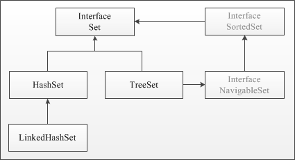

11. Интерфейс Set, его варианты и реализации.

# Интерфейс Set, его варианты и реализации.
Интерфейс `Set` расширяет интерфейс `Collection` и представляет набор уникальных элементов. `Set` не добавляет новых методов, только вносит изменения унаследованные. В частности, метод `add()` добавляет элемент в коллекцию и возвращает `true`, если в коллекции еще нет такого элемента.





| Метод | Описание |
|-------|----------|
| add(Object o) |	Добавление элемента в коллекцию, если он отсутствует. Возвращает true, если элемент добавлен. |
| addAll(Collection c) | Добавление элементов коллекции, если они отсутствуют. |
| clear() |	Очистка коллекции. |
| contains(Object o) | 	Проверка присутствия элемента в наборе. Возвращает true, если элемент найден. |
| containsAll(Collection c) | Проверка присутсвия коллекции в наборе. Возвращает true, если все элементы содержатся в наборе. |
| equals(Object o) | Проверка на равенство. |
| hashCode() | Получение hashCode набора. |
| isEmpty() |Проверка наличия элементов. Возвращает true если в коллекции нет ни одного элемента.|
| iterator() |	Функция получения итератора коллекции.|
| remove(Object o)|	Удаление элемента из набора.|
| removeAll(Collection c)| 	Удаление из набора всех элементов переданной коллекции.|
| retainAll(Collection c)| 	Удаление элементов, не принадлежащих переданной коллекции.|
| size()|Количество элементов коллекции. |
| toArray()| Преобразование набора в массив элементов.|
| toArray(T[] a)| 	Преобразование набора в массив элементов. В отличии от предыдущего метода, который возвращает массив объектов типа Object, данный метод возвращает массив объектов типа, переданного в параметре.|

К семейству интерфейса `Set` относятся `HashSet`, `TreeSet` и `LinkedHashSet`. В множествах `Set` разные реализации используют разный порядок хранения элементов. В `HashSet` порядок элементов оптимизирован для быстрого поиска. В контейнере `TreeSet` объекты хранятся отсортированными по возрастанию. `LinkedHashSet` хранит элементы в порядке добавления.

## `HashSet`
`HashSet` содержит методы аналогично `ArrayList`. Исключением является метод `add(Object o)`, который добавляет объект только в том случае, если он отсутствует. Если объект добавлен, то метод `add` возвращает значение — `true`, в противном случае `false`. Следует отметить, что порядок добавления записей в набор будет непредсказуемым. `HashSet использует хэширование для ускорения выборки.

Следует отметить, что реализация `HashSet` не синхронизируется. Если многократные потоки получают доступ к набору хеша одновременно, а один или несколько потоков должны изменять набор, то он должен быть синхронизирован внешне. Это лучше всего выполнить во время создания, чтобы предотвратить случайный несинхронизируемый доступ к набору:
```Java
Set<E> set = Collections.synchronizedSet(new HashSet<E>());
```

## `LinkedHashSet`
Класс `LinkedHashSet` наследует `HashSet`, не добавляя никаких новых методов, и поддерживает связный список элементов набора в том порядке, в котором они вставлялись. Это позволяет организовать упорядоченную итерацию вставки в набор.

Также, как и `HashSet`, `LinkedHashSet` не синхронизируется. Поэтому при использовании данной реализации в приложении с множеством потоков, часть из которых может вносить изменения в набор, следует на этапе создания выполнить синхронизацию :
```Java
Set<E> set = Collections.synchronizedSet(new LinkedHashSet<E>());
```

## `TreeSet`
Класс `TreeSet` создаёт коллекцию, которая для хранения элементов использует дерево. Объекты хранятся в отсортированном порядке по возрастанию.


