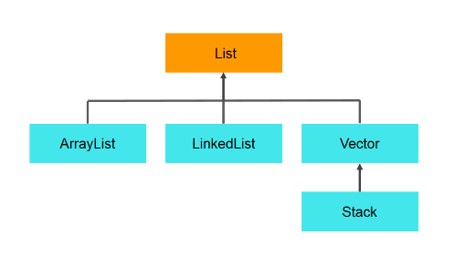
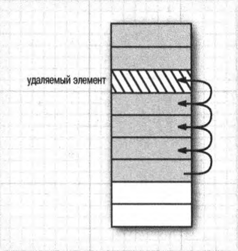
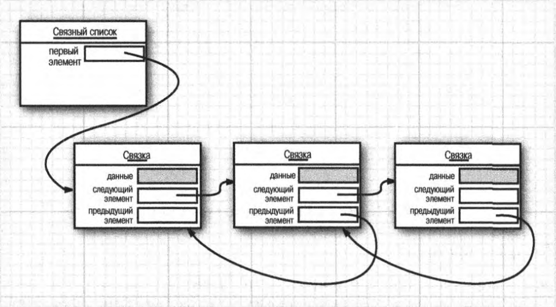

12. Интерфейс List и его реализации. Особенности класса Vector.

# Интерфейс List и его реализации. Особенности класса Vector.
Для создания простых списков применяется интерфейс List, который расширяет функцональность интерфейса Collection. Некоторые наиболее часто используемые методы интерфейса List:

| Метод | Описание |
|-------|----------|
|void add(int index, E obj) | добавляет в список по индексу index объект obj|
|boolean addAll(int index, Collection<? extends E> col)| добавляет в список по индексу index все элементы коллекции col. Если в результате добавления список был изменен, то возвращается true, иначе возвращается false|
|E get(int index)| возвращает объект из списка по индексу index|
|int indexOf(Object obj)| возвращает индекс первого вхождения объекта obj в список. Если объект не найден, то возвращается -1|
|int lastIndexOf(Object obj)| возвращает индекс последнего вхождения объекта obj в список. Если объект не найден, то возвращается -1|
|ListIterator<E> listIterator ()| возвращает объект ListIterator для обхода элементов списка|
|static <E> List<E> of(элементы)| создает из набора элементов объект List|
|E remove(int index)| удаляет объект из списка по индексу index, возвращая при этом удаленный объект|
|E set(int index, E obj)| присваивает значение объекта obj элементу, который находится по индексу index|
|void sort(Comparator<? super E> comp)| сортирует список с помощью компаратора comp|
|List<E> subList(int start, int end)| получает набор элементов, которые находятся в списке между индексами start и end|

## `ArrayList`
Класс `ArrayList` представляет обобщенную коллекцию, которая наследует свою функциональность от класса `AbstractList` и применяет интерфейс `List`. Проще говоря, `ArrayList` представляет простой список, аналогичный массиву, за тем исключением, что количество элементов в нем не фиксировано.

Емкость в `ArrayList` представляет размер массива, который будет использоваться для хранения объектов. При добавлении элементов фактически происходит перераспределение памяти - создание нового массива и копирование в него элементов из старого массива. Изначальное задание емкости `ArrayList` позволяет снизить подобные перераспределения памяти, тем самым повышая производительность.

## `LinkedList`
Обычные и списочные массивы страдают существенным недостатком.Удаление элемента из середины массива обходится дорого с точки зрения потребляемых вычислительных ресурсов, потому что все элементы, следующие за удаляемым, приходится перемещать к началу массива. Это же справедливо и для ввода элементов в середине массива.

Этот недостаток позволяет устранить другая широко известная структура данных — связный список. Если ссылки на объекты из массива хранятся в последовательных областях памяти, то каждый объект из связного списка — в отдельной связке. В языке программирования Java все связные списки на самом деле являются двунаправленными, т.е. в каждой связке хранится ссылка на ее предшественника. Удаление элемента из середины связного списка — недорогая операция с точки зрения потребляемых вычислительных ресурсов, поскольку в этом случае достаточно обновить лишь связки, соседние с удаляемым элементом.

## `Vector`
Класс `Vector` - реализация динамического массива объектов. Позволяет хранить любые данные, включая `null` в качестве элемента. `Vector` появился в JDK версии Java 1.0, но как и `Hashtable`, эту коллекцию не рекомендуется использовать, если не требуется достижения потокобезопасности. Потому как в `Vector`, в отличии от других реализаций `List`, все операции с данными являются синхронизированными. В качестве альтернативы часто применяется аналог — `ArrayList`