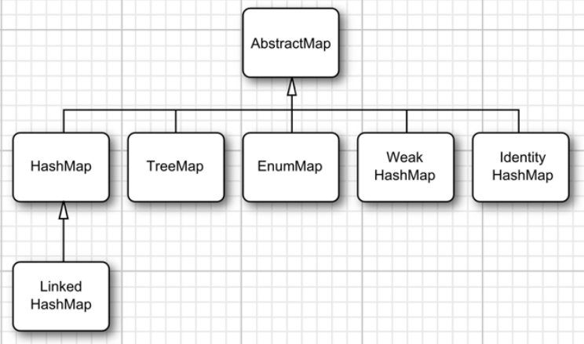

13. Интерфейс Map, его варианты и реализации.

# Интерфейс Map, его варианты и реализации.
Интерфейс `Map<K, V>` представляет отображение или иначе говоря словарь, где каждый элемент представляет пару "ключ-значение". При этом все ключи уникальные в рамках объекта `Map`. Такие коллекции облегчают поиск элемента, если нам известен ключ - уникальный идентификатор объекта.

Следует отметить, что в отличие от других интерфейсов, которые представляют коллекции, интерфейс `Map` НЕ расширяет интерфейс `Collection`.

Чтобы положить объект в коллекцию, используется метод `put`, а чтобы получить по ключу - метод `get`. Реализация интерфейса `Map` также позволяет получить наборы как ключей, так и значений. А метод `entrySet()` возвращает набор всех элементов в виде объектов `Map.Entry<K, V>`.

## `HashMap` и `TreeMap`
В библиотеке коллекций Java предоставляются две реализации отображений общего назначения: классы `HashMap` и `ТгееМар`, реализующие интерфейс `Мар`. Хеш-отображение типа `HashMap` хеширует ключи, а древовидное отображение типа `ТгееМар` использует общий порядок ключей для организации поискового дерева. Функции хеширования или сравнения применяются только к ключам. Значения, связанные с ключами, не хешируются и не сравниваются.

Когда же следует применять хеш-отображение, а когда — древовидное отображение? Как и во множествах, хеширование выполняется немного быстрее, и поэтому хеш-отображение оказывается более предпочтительным, если не требуется перебирать ключи в отсортированном порядке.

Ключи должны быть однозначными. Нельзя сохранить два значения по одинаковым ключам. Если дважды вызвать метод `put()` с одним и тем же ключом, то второе значение заменит первое. По существу, метод `put()` возвращает предыдущее значение, сохраненное по ключу, указанному в качестве его параметра.

## Слабые хеш-отображения

Класс `WeakHashMap` был разработан для решения одной интересной задачи. Что произойдет со значением, ключ которого не используется нигде больше в программе? Допустим, последняя ссылка на ключ исчезла. Следовательно, не остается никакого способа сослаться на объект-значение. Но поскольку ни одна часть программы больше не содержит обращения к данному ключу, то и соответствующая пара "ключ-значение" не может быть удалена из отображения. Почему бы системе сборки "мусора" не удалить эту пару? Разве это не ее задача — удалять неиспользуемые объекты?

К сожалению, все не так просто. Система сборки "мусора" отслеживает действующие объекты. До тех пор, пока действует объект хеш-отображения, все группы в нем активны и не могут быть освобождены из памяти. Поэтому прикладная программа должна позаботиться об удалении неиспользуемых значений из долгосрочных отображений. С другой стороны, можно воспользоваться структурой данных типа `WeakHashMap`, которая взаимодействует с системой сборки "мусора" для удаления пар "ключ-значение", когда единственной ссылкой на ключ остается ссылка из элемента хеш-таблицы.

Поясним принцип действия этого механизма. В хеш-отображении типа `WeakHashMap` используются слабые ссылки для хранения ключей. Объект типа `WeakHashMap` содержит ссылку на другой объект (в данном случае ключ из хеш-таблицы). Объекты этого типа интерпретируются системой сборки "мусора" особым образом. Если система сборки "мусора" обнаруживает отсутствие ссылок на конкретный объект, то она, как правило, освобождает занятую им память. А если объект доступен только из хеш-отображения типа `WeakHashMap`, то система сборки "мусора" освобождает и его, но размещает в очереди слабую ссылку на него. В операциях, выполняемых над хеш-отображением типа `WeakHashMap`, эта очередь периодически проверяется на предмет появления новых слабых ссылок. Появление такой ссылки в очереди свидетельствует о том, что ключ больше не используется нигде, но по-прежнему хранится в коллекции. В таком случае связанный с ним элемент удаляется из хеш-отображения типа `WeakHashMap`.

## Связные отображения
Класс `LinkedHashMap` запоминает порядок ввода в него элементов. Таким образом, можно избежать кажущегося случайным порядка расположения элементов в хеш-таблице. По мере ввода элементов в таблицу они присоединяются к двунаправленному связному списку.

## Хеш-отображения идентичности

Класс `IdentityHashMap` предназначен для построения хеш-отображения идентичности, преследующего особые цели, когда хеш-значения ключей должны вычисляться не методом `hashCode()`, а методом `System.identityHashCode()`. В этом методе для вычисления хеш-кода, исходя из адреса объекта в памяти, используется метод `Object.hashCode()`. Кроме того, для сравнения объектов типа `IdentityHashMap` применяется операция `==`, а не вызов метода `equals()`.

Иными словами, разные объекты-ключи рассматриваются как отличающиеся, даже если они имеют одинаковое содержимое. Этот класс удобен для реализации алгоритмов обхода объектов (например, сериализации объектов), когда требуется отслеживать уже пройденные объекты.

## `EnumMap`
Реализация `Map`, которая в качестве своих ключей содержит `Enum`.