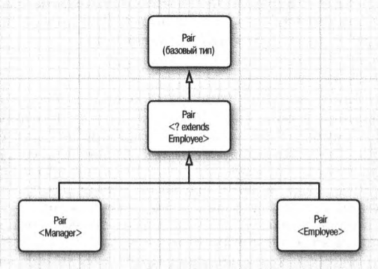

16. Работа с параметризованными методами. Ограничение типа сверху или снизу.

# Работа с параметризованными методами. Ограничение типа сверху или снизу.
## Обобщённые методы
В предыдущем билете было показано, как определяется обобщенный класс. Имеется также возможность определить отдельный метод с параметрами (или переменными) типа следующим образом:
```Java
class ArrayAlg {
public static <T> T getMiddle(Т... а) {
	return a[a.length / 2];
}
```
Этот метод определен в обычном, а не в обобщенном классе. Тем не менее это обобщенный метод, на что указывают угловые скобки и переменная типа. Обратите внимание на то, что переменная типа вводится после модификаторов доступа (в данном случае `public static`) и перед возвращаемым типом.

Обобщенные методы можно определять как в обычных, так и в обобщенных классах. Когда вызывается обобщенный метод, ему можно передать конкретные типы данных, заключая их в угловые скобки перед именем метода, как показано ниже.
```Java
String middle = ArrayAlg.<String>getMiddle("John", "Q.", "Public");
```
В данном случае (как и вообще) при вызове метода можно пропустить параметр типа `String`. У компилятора имеется достаточно информации, чтобы вывести из такого обобщения именно тот метод, который требуется вызвать. Он сравнивает тип параметра метода (т.е. `String[]` с обобщенным типом `Т[]`) и приходит к выводу, что вместо обобщенного типа Т следует подставить тип String, что равнозначно следующему вызову:
```Java
String middle = ArrayAlg.getMiddle("John", "Q.", "Public");
```
## Ограничения на переменные типа
Иногда класс или метод нуждается в наложении ограничений на переменные типа. Приведем характерный тому пример, в котором требуется вычислить наименьший элемент массива следующим образом:
```Java
class ArrayAlg 
{
	public static <T> T min(T[] а) // почти верно
	{
		if (а == null || a.length == 0) return null;
		Т smallest = а[0];
		for (int i = 1; i < a.length; i++)
			if (smallest.compareTo(a[i]) > 0) smallest = a[i];
		return smallest;
	}
}
```
Но здесь возникает затруднение. Обратите внимание на тело метода `min()`. Переменная `smallest` относится к типу `Т`, а это означает, что она может быть объектом произвольного класса. Но откуда известно, имеется ли метод `compareTo()` в том классе, к которому относится тип `Т`?

Выход из этого затруднительного положения состоит в том, чтобы наложить ограничение на тип `Т` и вместо него подставлять только класс, реализующий
`Comparable` — стандартный интерфейс с единственным методом `соmраrеТо()`. Для этого достаточно наложить *ограничение* на переменную типа `Т` следующим образом:
```Java
public static <Т extends Comparable> Т min(T[] а) . . .
```
Теперь обобщенный метод `min()` может вызываться только с массивами классов, реализующих интерфейс `Comparable`, в том числе `String`, `Date` и т.п. А вызов `min()` с массивом типа `Rectangle` приведет к ошибке во время компиляции, поскольку класс `Rectangle` не реализует интерфейс `Comparable`.

Вас может удивить, почему здесь используется ключевое слово extends вместо `implements`, ведь `Comparable` — это интерфейс? Так, обозначение
```Java
<Т extends ограничивающий_тип>
```
означает, что тип `Т` должен быть *подтипом* ограничивающего типа, причем к типу `Т` и ограничивающему типу может относиться как интерфейс, так и класс. Ключевое слово `extends` выбрано потому, что это вполне благоразумное приближение понятия подтипа, и создатели Java не сочли нужным вместо этого вводить в язык новое ключевое слово.

Переменная типа или подстановка может иметь несколько ограничений, как показано в приведенном ниже примере кода. Ограничивающие типы разделяются знаком `&`, потому что запятые служат для разделения переменных типа.
```Java
Т extends Comparable & Serializable
```
Как и в механизме наследования в Java, у интерфейсов может быть сколько угодно супертипов, но только один из ограничивающих типов может быть классом. Если для ограничения служит класс, он должен быть первым в списке накладываемых ограничений.

В следующем примере программы метод `minmax()` переделан на обобщенный. В этом методе вычисляется минимальное и максимальное значения в обобщенном массиве и возвращается объект обобщенного типа `Pair<T>`.
```Java
import java.time.LocalDate;

public class PairTest2 {
    public static void main(String[] args) {
        LocalDate[] birthdays = {
                LocalDate.of(2001, 11, 26), // Eka
                LocalDate.of(2001, 8, 15), // Lev
                LocalDate.of(2001, 5, 28), // Yana
                LocalDate.of(2001, 3, 30), // Max
                LocalDate.of(2001, 3, 30), // Styopa
                LocalDate.of(2001, 1, 27), // Vova
                LocalDate.of(2001, 5, 23), // Grisha
                LocalDate.of(2001, 3, 10), // Sasha
        };
        Pair<LocalDate> mm = ArrayAlg.minmax(birthdays);
        System.out.println("min = " + mm.getFirst());
        System.out.println("max = " + mm.getSecond());
    }
}

class ArrayAlg {
    /**
     * Получает минимальное и максимальное значения
     * из массива объектов типа T
     * @param a - Массив объектов типа T
     * @return Пара минимального и максимального значений или
     * пустое значение, если параметр a имеет пустое значение
     */
    public static <T extends Comparable> Pair<T> minmax(T[] a) {
        if (a == null || a.length == 0) {
            return null;
        }
        T min = a[0];
        T max = a[0];
        for (int i = 0; i < a.length; i++) {
            if (min.compareTo(a[i]) > 0) min = a[i];
            if (max.compareTo(a[i]) < 0) max = a[i];
        }
        return new Pair<>(min, max);
    }
}

class Pair<T> {
    private T first;
    private T second;

    public Pair() { first = null; second = null; }
    public Pair(T first, T second)
    { this.first = first; this.second = second; }

    public T getFirst() { return first; }
    public T getSecond() { return second; }

    public void setFirst(T newValue) { first = newValue; }
    public void setSecond(T newValue) { second = newValue; }
}
```

## Подстановочные типы (Wildcard)
Исследователям систем типов уже давно известно, что жесткие системы обобщенных типов использовать довольно неприятно. Поэтому создатели Java придумали
изящный (и тем не менее безопасный) выход из положения: *подстановочные типы*.

### Понятие подстановочного типа
В подстановочном типе параметр типа может быть переменным. Например, следующий подстановочный тип обозначает любой обобщенный тип `Pair`, параметр
типа которого представляет подкласс, производный от класса `Employee`, в частности, класс `Pair<Manager>`, но не класс `Pair<String>`.
```Java
Pair<? extends Employee>
```
Допустим, требуется написать следующий метод, который выводит пары сотрудников:
```Java
public static void printBuddies(Pair<Employee> p){
	Employee first = p.getFirst();
	Employee second = p.getSecond();
	System.out.println(first.getName() + " and " +
		second.getName () + " are buddies.");
}
```
Передать объект типа `Pair<Manager>` этому методу нельзя, что не совсем удобно. Но из этого положения имеется простой выход — использовать подстановочный тип следующим образом:
```Java
public static void printBuddies(Pair<? extends Employee> p)
```
Тип `Pair<Manager>` является подтипом `Pair<? extends Employee>`.



А могут ли подстановки нарушить тип Pair<Manager> по ссылке `Pair<? extends Employee>`? Не могут, как показано в приведенном ниже фрагменте кода.
```Java
Pair<Manager> managerBuddies = new Pairo(ceo, cfo) ;
Pair<? extends Employee> wildcardBuddies = managerBuddies; // Допустимо!
wildcardBuddies.setFirst(lowlyEmployee); // Ошибка при компиляции!
```
Но в то же время вызов метода `setFirst()` приведет к ошибке соблюдения типов. Чтобы стала понятнее причина этой ошибки, проанализируем тщательнее обобщенный класс типа `Pair<? extends Employee>` У него имеются следующие методы:
```Java
? extends Employee getFirstO
void setFirst(? extends Employee)
```
Это делает невозможным вызов метода `setFirst()`. Компилятору требуется какой-нибудь подтип `Employee`, но неизвестно, какой именно. Он отказывается передать любой конкретный тип, поскольку знак подстановки ? может и не совпасть с этим типом. При вызове метода `getFirst()` такое затруднение не возникает. Значение, возвращаемое методом `getFirst()`, вполне допустимо присвоить переменной ссылки на объект типа Employee. В этом, собственно, и состоит главный смысл ограниченных подстановок. С их помощью можно теперь отличать безопасные методы доступа от небезопасных модифицирующих методов.

### Ограничение супертипа на подстановки
Ограничения на подстановки подобны ограничениям на переменные типа. Но
у них имеется дополнительная возможность — определить ограничение супертипа следующим образом:
```Java
? super Manager
```
Эта подстановка ограничивается всеми супертипами Manager.

Если рассуждать интуитивно, то подстановки с ограничениями супертипа позволяют записывать данные в обобщенный объект, а подстановки с ограничениями подтипа — читать данные из обобщенного объекта.


