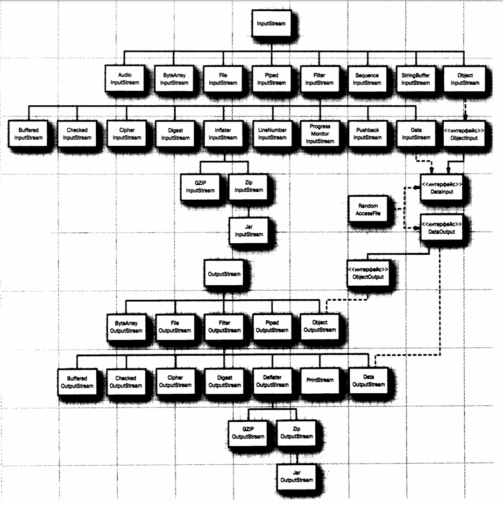
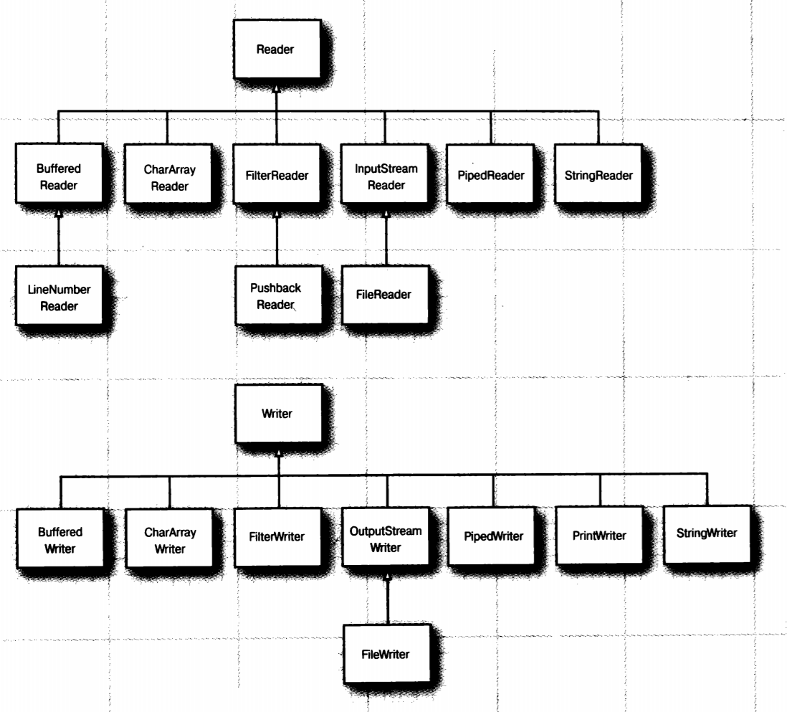

17. Потоки ввода-вывода в Java. Байтовые и символьные потоки.

# Потоки ввода-вывода в Java. Байтовые и символьные потоки.
Отличительной чертой многих языков программирования является работа с файлами и потоками. В Java основной функционал работы с потоками сосредоточен в классах из пакета **java.io**.

Ключевым понятием здесь является понятие **потока**. Хотя понятие "поток" в программировании довольно перегружено и может обозначать множество различных концепций. В данном случае применительно к работе с файлами и вводом-выводом мы будем говорить о потоке (stream), как об абстракции, которая используется для чтения или записи информации (файлов, сокетов, текста консоли и т.д.).

Поток связан с реальным физическим устройством с помощью системы ввода-вывода Java. У нас может быть определен поток, который связан с файлом и через который мы можем вести чтение или запись файла. Это также может быть поток, связанный с сетевым сокетом, с помощью которого можно получить или отправить данные в сети. Все эти задачи: чтение и запись различных файлов, обмен информацией по сети, ввод-ввывод в консоли мы будем решать в Java с помощью потоков.

Объект, из которого можно считать данные, называется **потоком ввода**, а объект, в который можно записывать данные, - **потоком вывода**. Например, если надо считать содержание файла, то применяется поток ввода, а если надо записать в файл - то поток вывода.
 
В основе всех классов, управляющих потоками байтов, находятся два абстрактных класса: **InputStream** (представляющий потоки ввода) и **OutputStream** (представляющий потоки вывода)

Но поскольку работать с байтами не очень удобно, то для работы с потоками символов были добавлены абстрактные классы **Reader** (для чтения потоков символов) и **Writer** (для записи потоков символов).

Все остальные классы, работающие с потоками, являются наследниками этих абстрактных классов. Основные классы потоков:

## Потоки байтов



### Класс InputStream
Класс InputStream является базовым для всех классов, управляющих байтовыми потоками ввода. Рассмотрим его основные методы:

| Метод | Описание |
|-------|----------|
| int available() | возвращает количество байтов, доступных для чтения в потоке |
| void close() | закрывает поток |
| int read() | возвращает целочисленное представление следующего байта в потоке. Когда в потоке не останется доступных для чтения байтов, данный метод возвратит число -1 |
| int read(byte[] buffer) | считывает байты из потока в массив buffer. После чтения возвращает число считанных байтов. Если ни одного байта не было считано, то возвращается число -1 |
| int read(byte[] buffer, int offset, int length) | считывает некоторое количество байтов, равное length, из потока в массив buffer. При этом считанные байты помещаются в массиве, начиная со смещения offset, то есть с элемента buffer[offset]. Метод возвращает число успешно прочитанных байтов. |
| long skip(long number) | пропускает в потоке при чтении некоторое количество байт, которое равно number |

### Класс OutputStream
Класс OutputStream является базовым классом для всех классов, которые работают с бинарными потоками записи. Свою функциональность он реализует через следующие методы:

| Метод | Описание |
|-------|----------|
| void close() | закрывает поток |
| void flush()| очищает буфер вывода, записывая все его содержимое |
| void write(int b) | записывает в выходной поток один байт, который представлен целочисленным параметром b |
| void write(byte[] buffer) | записывает в выходной поток массив байтов buffer |
| void write(byte[] buffer, int offset, int length) | записывает в выходной поток некоторое число байтов, равное length, из массива buffer, начиная со смещения offset, то есть с элемента buffer[offset] |

## Потоки символов



### Абстрактный класс Reader

Абстрактный класс Reader предоставляет функционал для чтения текстовой информации. Рассмотрим его основные методы:

| Метод | Описание |
|-------|----------|
| absract void close() | закрывает поток ввода |
| int read() | возвращает целочисленное представление следующего символа в потоке. Если таких символов нет, и достигнут конец файла, то возвращается число -1 |
| int read(char[] buffer) | считывает в массив buffer из потока символы, количество которых равно длине массива buffer. Возвращает количество успешно считанных символов. При достижении конца файла возвращает -1 |
| int read(CharBuffer buffer) | считывает в объект CharBuffer из потока символы. Возвращает количество успешно считанных символов. При достижении конца файла возвращает -1 |
| absract int read(char[] buffer, int offset, int count) | считывает в массив buffer, начиная со смещения offset, из потока символы, количество которых равно count |
| long skip(long count) | пропускает количество символов, равное count. Возвращает число успешно пропущенных символов |

### Абстрактный класс Writer
Класс Writer определяет функционал для всех символьных потоков вывода. Его основные методы:
| Метод | Описание | 
|-------|----------|
| Writer append(char c) | добавляет в конец выходного потока символ c. Возвращает объект Writer |
| Writer append(CharSequence chars) | добавляет в конец выходного потока набор символов chars. Возвращает объект Writer |
| abstract void close()| закрывает поток|
| abstract void flush() | очищает буферы потока |
| void write(int c) | записывает в поток один символ, который имеет целочисленное представление |
| void write(char[] buffer) | записывает в поток массив символов |
| absract void write(char[] buffer, int off, int len) | записывает в поток только несколько символов из массива buffer. Причем количество символов равно len, а отбор символов из массива начинается с индекса off |
| void write(String str) | записывает в поток строку |
| void write(String str, int off, int len) | записывает в поток из строки некоторое количество символов, которое равно len, причем отбор символов из строки начинается с индекса off |

Функционал, описанный классами Reader и Writer, наследуется непосредственно классами символьных потоков, в частности классами FileReader и FileWriter соответственно, предназначенными для работы с текстовыми файлами.

## Сочетание потоковых фильтров
В Java применяется искусный механизм для разделения двух видов обязанностей. Одни потоки ввода-вывода (типа `FileInputStream` и поток ввода, возвращаемый методом `openStream()` из класса `URL`) могут извлекать байты из файлов и других более экзотических мест, а другие потоки ввода-вывода (типа `DatalnputStream` и `PrintWriter`) — составлять эти байты в более полезные типы данных. Программирующему на Java остается только употреблять их в нужном сочетании. Например, для того чтобы получить возможность читать числа из файла, достаточно создать сначала объект потока ввода типа `FileInputStream`, а затем передать его конструктору класса `DataInputStream`, как показано ниже.
```Java
FilelnputStream fin = new FilelnputStream("employee.dat");
DatalnputStream din = new DatalnputStream(fin);
double s = din.readDouble();
```
Если снова посмотреть на рисунок, то в иерархии классов для потоков ввода-вывода можно обнаружить классы `FilterInputStream` и `FilterOutputStream`. Подклассы этих классов служат для **расширения** функциональных возможностей базовых байтовых потоков ввода-вывода.

Благодаря вложению фильтров можно расширить функциональные возможности в еще большей степени. Например, по умолчанию потоки не буферизуются. Это означает, что каждый вызов метода `read()` приводит к запрашиванию у операционной системы выдачи очередного байта. Но намного эффективнее запрашивать сразу целые блоки данных и размещать их в буфере. Потребность использовать буферизацию и методы ввода данных в файл диктует применение следующей довольно громоздкой последовательности конструкторов:
```Java
DatalnputStream din = new DatalnputStream(
new BufferedlnputStream(
new FilelnputStream("employee.dat")));
```
Обратите внимание на то, что конструктор класса `DatalnputStream` указывается последним в цепочке конструкторов. Ведь в данном случае предполагается использовать методы из класса `DatalnputStream`, а в них — буферизуемый метод `read()`.

Иногда возникает потребность отслеживать промежуточные потоки ввода-вывода, когда они соединяются в цепочку. Например, при считывании входных данных нередко требуется считывать следующий байт с упреждением, чтобы выяснить, содержится ли в нем предполагаемое значение. Для этой цели в Java предоставляется класс `PushbackInputStream`, как показано ниже.
```Java
PushbacklnputStream pbin = new PushbacklnputStream(
	new BufferedlnputStream(
		new FilelnputStream("employee.dat")));
```
Теперь можно сначала прочитать следующий байт с упреждением:
```Java
int b = pbin.read();
```
а затем возвратить его обратно, если он не содержит именно то, что нужно:
```Java
if (b != '<') pbin.unread(b);
```
Но методы чтения `read()` и непрочтения `unread()` являются единственными методами, которые можно применять в потоке ввода типа `PushbacklnputStream`. Так, если нужно считывать числовые данные с упреждением, то для этого потребуется ссылка не только на поток ввода типа `PushBacklnputStream`, но и на поток ввода типа `DatalnputStream`:
```Java
DataInputStream din = new DataInputStream(
	pbin = new PushbacklnputStream(
		new BufferedlnputStream(
			new FilelnputStream("employee.dat"))));
```