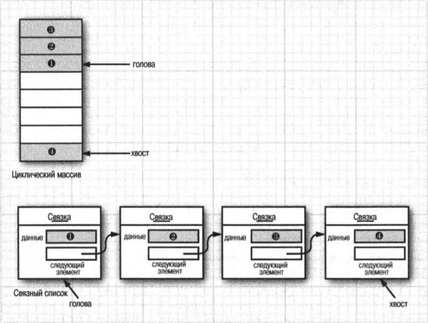
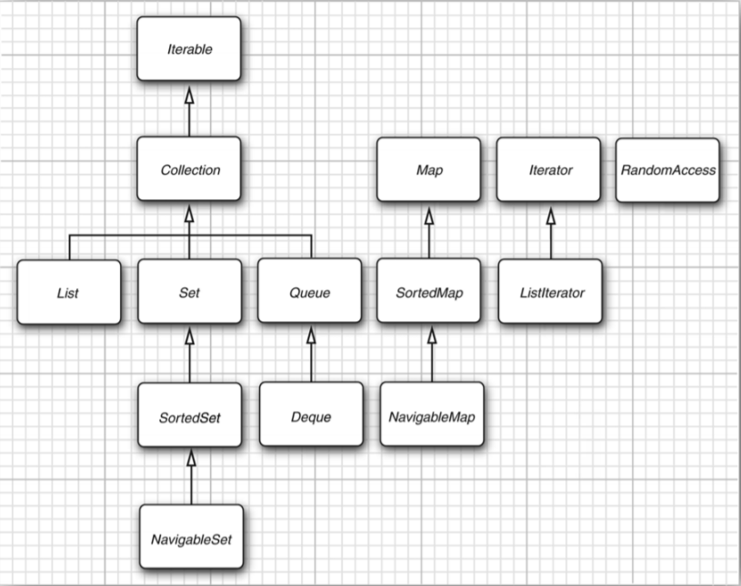
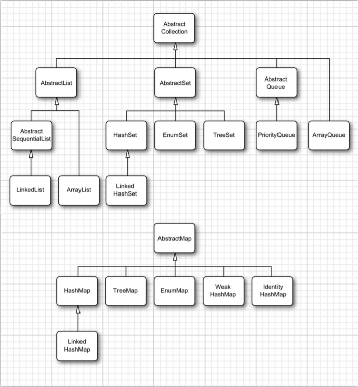

8. Коллекции. Виды коллекций. Интерфейсы Set, List, Queue. 

# Коллекции. Виды коллекций. Интерфейсы Set, List, Queue. 
## Разделение интерфейсов и реализаций коллекций
Как это принято в современных библиотеках структур данных, в рассматриваемой здесь библиотеке коллекций Java интерфейсы и реализации разделены. Рассмотрим, как это разделение происходит на примере хорошо известной структуры данных — очереди. Интерфейс очереди определяет, что элементы можно добавлять в хвосте очереди, удалять их в ее голове, а также выяснять, сколько элементов находится в очереди в данный момент. Очереди применяются в тех случаях, когда требуется накапливать объекты и извлекать их по принципу "первым пришел — первым обслужен".

Самая элементарная форма интерфейса очереди может выглядеть так, как показано ниже.
```Java
interface Queue<E> // простейшая форма интерфейса очереди из стандартной библиотеки
{
	void add(E element);
	Е remove();
	int size();
}
```
Из интерфейса нельзя ничего узнать, каким образом реализована очередь. В одной из широко распространенных реализаций очереди применяется циклический массив, а в другой — связный список.


Каждая реализация может быть выражена классом, реализующим интерфейс `Queue`, как показано ниже.
```Java
// этот класс не из библиотеки
class CircularArrayQueue<E> implements Queue<E> {
	CircularArrayQueue(int capacity) { . . . }
	public void add(E element) { . . . }
	public E remove() { . . . }
	public int size() { . . . }
	private E[] elements;
	private int head;
	private int tail;
}

// и этот класс не из библиотеки
class LinkedListQueue<E> implements Queue<E> {
LinkedListQueue() { . . . }
public void add(E element) { . . . }
public E remove() (...)
public int size() (...)
private Link head;
private Link tail;
}
```

Применяя в своей программе очередь, совсем не обязательно знать, какая именно реализация используется для построения коллекции. Таким образом, конкретный класс имеет смысл использовать только в том случае, если конструируется объект коллекции. А тип интерфейса служит лишь для ссылки на коллекцию, как показано ниже.
```Java
Queue<Customer> expressLane = new CircularArrayQueue<>(100);
expressLane.add(new Customer("Harry"));
```
Если придется изменить решение, то при таком подходе нетрудно будет воспользоваться другой реализацией. Для этого достаточно внести изменения только в одном месте программы: при вызове конструктора. Так, если остановить свой выбор на классе `LinkedListQueue`, код реализации очереди в виде связного списка будет
выглядеть следующим образом:
```Java
Queue<Customer> expressLane = new LinkedListQueue<>();
expressLane.add(new Customer("Harry"));
```
Почему выбирается одна реализация, а не другая? Ведь из самого интерфейса ничего нельзя узнать об эффективности реализации. Циклический массив в некотором отношении более эффективен, чем связный список, и поэтому ему обычно отдается предпочтение. Но, как всегда, за все нужно платить. Циклический массив является ограниченной коллекцией, имеющей конечную емкость. Поэтому если неизвестен верхний предел количества объектов, которые должна накапливать прикладная программа, то имеет смысл выбрать реализацию очереди на основе связного списка.

Изучая документацию на прикладной программный интерфейс API, вы непременно обнаружите другой набор классов, имена которых начинаются на `Abstract`, как, например, `AbstractQueue`. Эти классы предназначены для разработчиков библиотек. В том редком случае, когда вам потребуется реализовать свой собственный класс очереди, вы обнаружите, что сделать это проще, расширив класс `AbstractQueue`, чем реализовывать все методы из интерфейса `Queue`.
## Интерфейс Collection
Основополагающим для классов коллекций в библиотеке Java является интерфейс `Collection`. В его состав входят два основных метода:
```Java
public interface Collection<E> {
	boolean add(E element);
	Iterator<E> iterator();
}
```
Метод `add()` добавляет элемент в коллекцию. Он возвращает логическое значение `true`, если добавление элемента в действительности изменило коллекцию, а если коллекция осталась без изменения — логическое значение `false`. Так, если попытаться добавить объект в коллекцию, где такой объект уже имеется, вызов метода `add()` не даст желаемого результата, поскольку коллекция не допускает дублирование объектов. А метод `iterator()` возвращает объект класса, реализующего интерфейс `Iterator`. Объект итератора можно выбрать для обращения ко всем элементам коллекции по очереди. 

## Интерфейсы в каркасе коллекций Java
В каркасе коллекций Java определен целый ряд интерфейсов для различных типов коллекций, как показано на рисунке.


## List
Список представляет собой упорядоченную коллекцию. Элементы добавляются
на определенной позиции в контейнере. Доступ к элементу списка осуществляется
с помощью итератора или по целочисленному индексу. В последнем случае доступ
оказывается произвольным, поскольку к элементам можно обращаться в любом порядке. А если используется итератор, то обращаться к элементам списка можно только по очереди.
Для произвольного доступа к элементам списка в интерфейсе L is t определяются
следующие методы:
```Java
void add(int index, Е element)
void remove(int index)
E get(int index)
E set(int index, E element)
```
## Set
Интерфейс `Set` подобен интерфейсу `Collection`, но поведение его методов определено более строго. В частности, метод `add()` должен отвергать дубликаты во множестве. Метод `equals()` должен быть определен таким образом, чтобы два множества считались одинаковыми, если они содержат одни и те же элементы, но не обязательно в одинаковом порядке. А метод `hashCode()` должен быть определен таким образом, чтобы два множества с одинаковыми элементами порождали один и тот же хеш-код.

Зачем же объявлять отдельные интерфейсы, если сигнатуры их методов совпадают? В принципе не все коллекции являются множествами. Поэтому наличие интерфейса `Set` дает программистам возможность писать методы, принимающие только множества.

## Конкретные коллекции
| Тип коллекции | Описание |
|---------------|----------|
|ArrayList | Индексированная динамически расширяющаяся и сокращающаяся последовательность |
|LinkedList | Упорядоченная последовательность, допускающая эффективную вставку и удаление на любой позиции |
|ArrayDeque | Двунаправленная очередедь, реализуемая в виде циклического массива |
|HashSet | Неупорядоченная коллекция, исключающая дубликаты |
|TreeSet | Отсортированное множество |
|EnumSet | Множество значений перечислимого типа |
|LinkedHashSet | Множество, запоминающее порядок ввода элементов |
|PriorityQueue | Коллекция, позволяющая эффективно удалять наименьший элемент |


